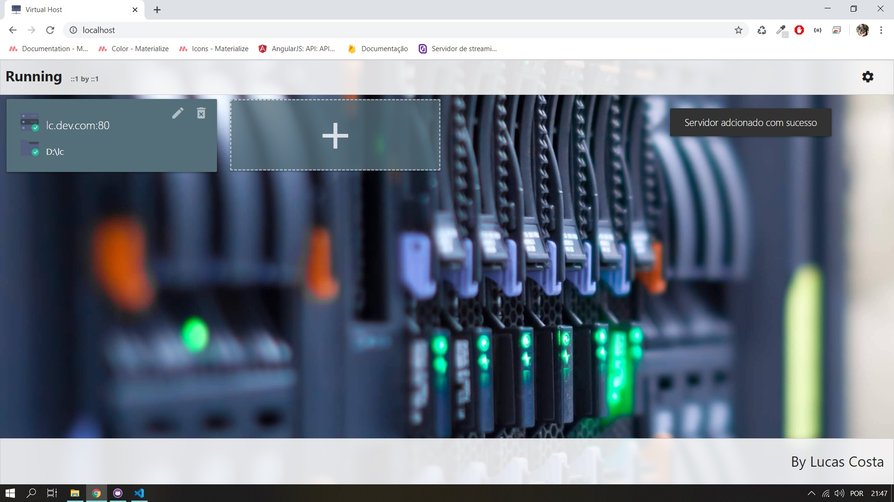
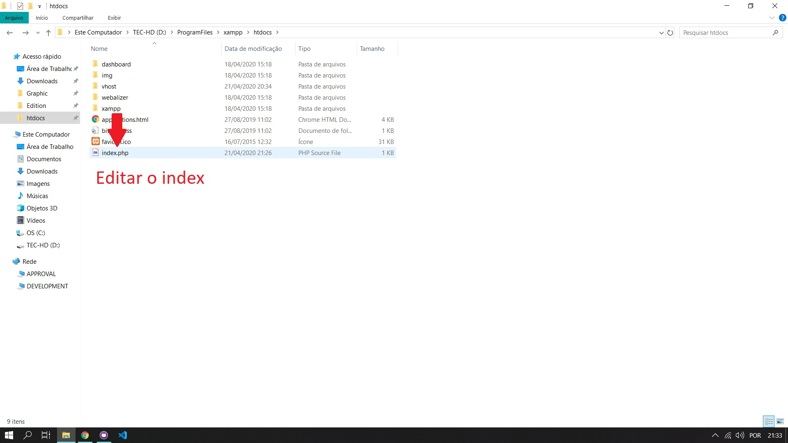
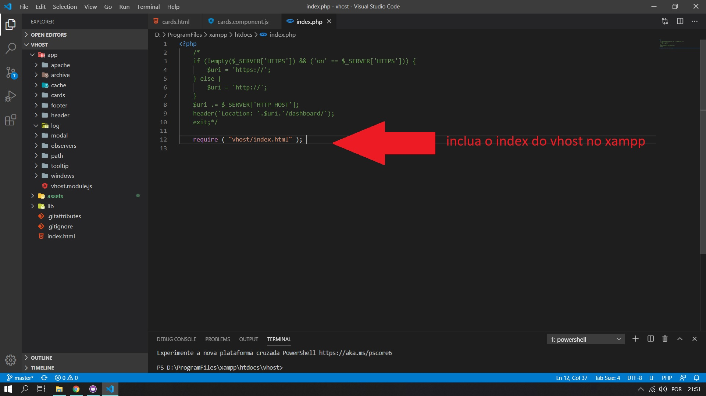
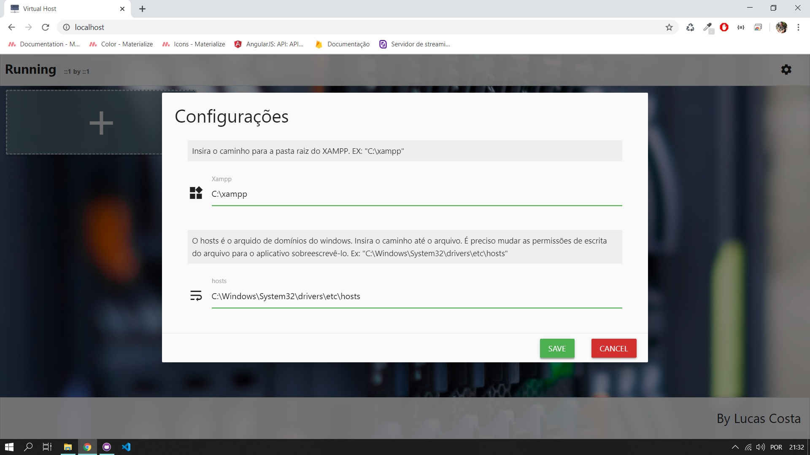
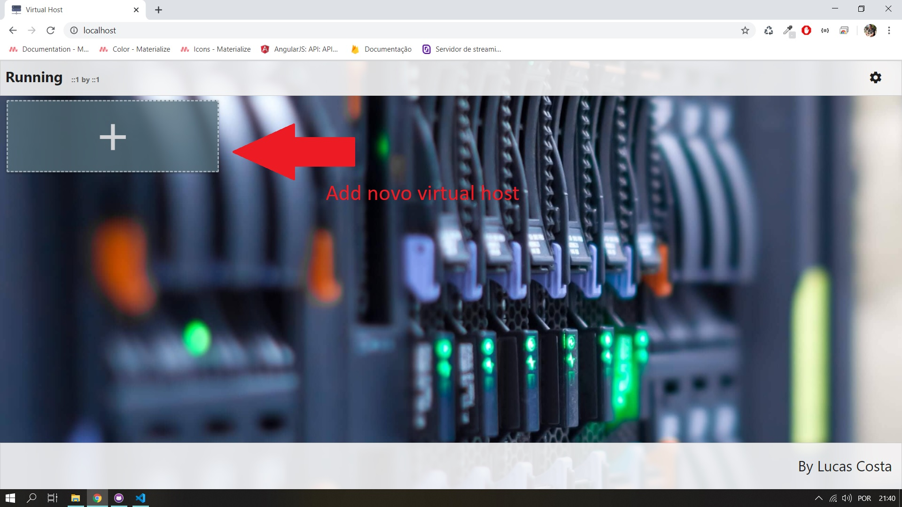
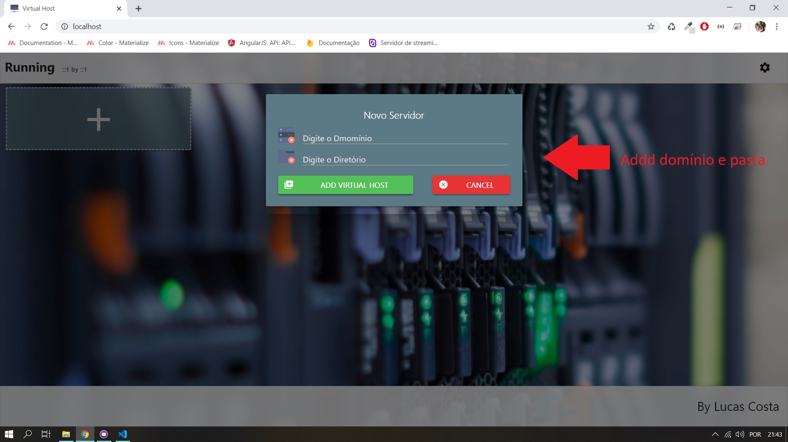

# VHost PHP
É um software para criar de forma intuitiva Virtual Hosts usando o XAMPP no windows.

 
 
 # Instalação:
 ## Etapa 1
 Baixe os arquivos, e coloque na pasta htdos do XAMPP e edite o index.php na raiz do XAMPP confor as imagens abaixo:
 
 
 
 
 ## Etapa 2
 Inicie o Apache do XAMPP e abra localhost. Abra configurações e digite o local da pasta XAMPP e o local do arquivos hosts do windows. 
 Normalmente localizado em "C:\Windows\System32\drivers\etc\hosts"
 Nessa etapa é necessário que libere as permissões de escrita para o arquivo hosts do windows.
 Depois save as configurações.
 
 
 
 ## Etapa 3
 Clique em adicionar novo Virtual Host e preencha com o dominío local e a pasta do novo host.
 
 
 
 
 ## Etapa 4
 Para que o Servidor Virtual funcione é necessário reinicair o Apache.
 
 
